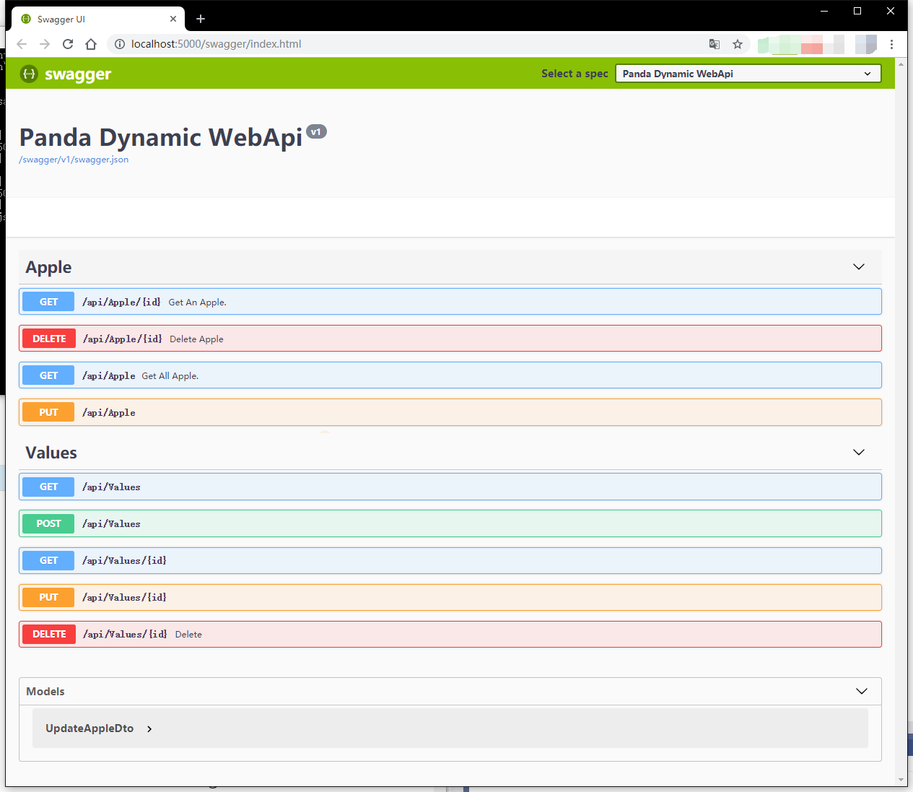

# Panda.DynamicWebApi

`Panda.DynamicWebApi` 是一个动态生成WebApi的组件，生成的API符合Restful风格，受启发于ABP。它可以根据符合条件的类来生成WebApi，由MVC框架直接调用逻辑，无性能问题，完美兼容Swagger来构建API说明文档，与手动编写Controller相比并无区别。

应用场景：DDD架构中的应用逻辑层，可使用本组件来直接生成WebApi，而无需再用Controller来调用。

[](https://www.nuget.org/packages/Panda.DynamicWebApi/)

## 1.快速入门

（1）新建一个 ASP.NET Core WebApi(或MVC) 项目

（2）通过Nuget安装组件

````shell
Install-Package Panda.DynamicWebApi
````

（3）创建一个类命名为 `AppleAppService`，实现 `IDynamicWebApi` 接口，并加入特性 `[DynamicWebApi]`

````csharp
[DynamicWebApi]
public class AppleAppService: IDynamicWebApi
{
    private static readonly Dictionary<int,string> Apples=new Dictionary<int, string>()
    {
        [1]="Big Apple",
        [2]="Small Apple"
    };

    /// <summary>
    /// Get An Apple.
    /// </summary>
    /// <param name="id"></param>
    /// <returns></returns>
    [HttpGet("{id:int}")]
    public string Get(int id)
    {
        if (Apples.ContainsKey(id))
        {
            return Apples[id];
        }
        else
        {
            return "No Apple!";
        }
    }

    /// <summary>
    /// Get All Apple.
    /// </summary>
    /// <returns></returns>
    public IEnumerable<string> Get()
    {
        return Apples.Values;
    }

    public void Update(UpdateAppleDto dto)
    {
        if (Apples.ContainsKey(dto.Id))
        {
            Apples[dto.Id] =dto.Name;
        }
    }

    /// <summary>
    /// Delete Apple
    /// </summary>
    /// <param name="id">Apple Id</param>
    [HttpDelete("{id:int}")]
    public void Delete(int id)
    {
        if (Apples.ContainsKey(id))
        {
            Apples.Remove(id);
        }
    }

}
````

（4）在 Startup 中注册 DynamicWebApi

````csharp
public void ConfigureServices(IServiceCollection services)
{
    // 默认配置
    services.AddDynamicWebApi();

    // 自定义配置
    services.AddDynamicWebApi((options) =>
    {
        // 指定全局默认的 api 前缀
        options.DefaultApiPrefix = "apis";
    
        /**
         * 清空API结尾，不删除API结尾;
         * 若不清空 CreatUserAsync 将变为 CreateUser
         */
        options.RemoveActionPostfixes.Clear();
    
        /**
         * 自定义 ActionName 处理函数;
         */
        options.GetRestFulActionName = (actionName) => actionName;
    
        /**
         * 指定程序集 配置 url 前缀为 apis
         * 如: http://localhost:8080/apis/User/CreateUser
         */
        options.AddAssemblyOptions(this.GetType().Assembly, apiPreFix: "apis");
    
        /**
         * 指定程序集 配置所有的api请求方式都为 POST
         */
        options.AddAssemblyOptions(this.GetType().Assembly, httpVerb: "POST");
    
        /**
         * 指定程序集 配置 url 前缀为 apis, 且所有请求方式都为POST
         * 如: http://localhost:8080/apis/User/CreateUser
         */
        options.AddAssemblyOptions(this.GetType().Assembly, apiPreFix: "apis", httpVerb: "POST");
    });
}
````

（5）添加 Swagger 

（6）运行

运行浏览器以后访问 `<你的项目地址>/swagger/index.html`，将会看到为我们 `AppleAppService` 生成的 WebApi



本快速入门 Demo 地址：[点我](/samples/Panda.DynamicWebApiSample)

## 2.更进一步

（1）要让类生成动态API需要满足两个条件，一个是该类**直接**或**间接**实现 `IDynamicWebApi`，同时该类**本身**或者**父抽象类**或者**实现的接口**具有特性 `DynamicWebApi`

（2）添加特性 `[NonDynamicWebApi]` 可使一个类或者一个方法不生成API，`[NonDynamicWebApi]` 具有最高的优先级。

（3）会对符合规则的动态API**类名**进行后缀的删除，如：我们快速入门的 `AppleAppService`，会被删除 AppService 后缀，这个规则是可以动态配置的。

（4）会自动添加API路由前缀，默认会为所有API添加 `api`前缀

（5）默认的HTTP动词为`POST`，可以理解为API的 Http Method。但可以通过 `HttpGet/HttpPost/HttpDelete `等等ASP.NET Core 内置特性来覆盖

（6）可以通过`HttpGet/HttpPost/HttpDelete `等内置特性来覆盖默认路由

（7）默认会根据你的方法名字来设置HTTP动词，如 CreateApple 或者 Create 生成的API动词为 `POST`，对照表如下，若命中（忽略大小写）对照表那么该API的名称中的这部分将会被省略，如 CreateApple 将会变成 Apple，如未在以下对照表中，将会使用默认动词 `POST`

| 方法名开头 | 动词   |
| ---------- | ------ |
| create     | POST   |
| add        | POST   |
| post       | POST   |
| get        | GET    |
| find       | GET    |
| fetch      | GET    |
| query      | GET    |
| update     | PUT    |
| put        | PUT    |
| delete     | DELETE |
| remove     | DELETE |

（8）强烈建议方法名称使用帕斯卡命名（PascalCase）规范，且使用以上对照表的动词。如:

添加苹果 -> Add/AddApple/Create/CreateApple

更新苹果 -> Update/UpdateApple

...

（9）`[DynamicWebApi]` 特性因为可被继承，所以为了父类被误识别，禁止放在除抽象类、接口以外的父类上。
（10）自定义 WebApi注册
### 1.基础功能
```csharp
public void ConfigureServices(IServiceCollection services)
{
    // 自定义配置
    services.AddDynamicWebApi((options) =>
    {
        //自定义注册的WebApi
        options.SelectController = new ServiceLocalSelectController();
        //自定义WebApi路由地址
        options.ActionRouteFactory = new ServiceActionRouteFactory();
    });
}
```

根据 ServiceAttribute 注册WebApi和分配路由地址
```csharp
[AttributeUsage(AttributeTargets.Class)]
public class ServiceAttribute : Attribute
{
    public ServiceAttribute()
    {
        ServiceName = string.Empty;
    }

    public ServiceAttribute(string serviceName)
    {
        ServiceName = serviceName;
    }

    public string ServiceName { get; }
}
```

实现 ISelectController 接口，通过查找类是否有ServiceAttribute特性为注册WebApi条件
```csharp
internal class ServiceLocalSelectController : ISelectController
{
    public bool IsController(Type type)
    {
        return type.IsPublic && type.GetCustomAttribute<ServiceAttribute>() != null;
    }
}
```

实现 IActionRouteFactory 接口，生成路由规则 /api/ServiceName/Method
```csharp
internal class ServiceActionRouteFactory : IActionRouteFactory
{
    public string CreateActionRouteModel(string areaName, string controllerName, ActionModel action)
    {
        var controllerType = action.ActionMethod.DeclaringType;
        var serviceAttribute = controllerType.GetCustomAttribute<ServiceAttribute>();

        var _controllerName = serviceAttribute.ServiceName == string.Empty ? controllerName.Replace("Service", "") : serviceAttribute.ServiceName.Replace("Service", "");

        return $"api/{_controllerName}/{action.ActionName.Replace("Async", "")}";
    }
}
```
ServiceAttribute.ServiceName为空时，controllerName 替换 "Service" 字符串为空，反之则 ServiceAttribute.ServiceName 替换 "Service" 字符串为空。
Method 名替换 "Async" 字符串为空。

### 2.外部动态 WebApi
创建一个 Other.Controller
实现 一个外部 Service
```csharp
[Service("Other.Server")]
public class OtherService
{
    public int Show()
    {
        return 100;
    }

    public Task<int> TaskIntAsync()
    {
        return Task.FromResult(100);
    }
}
```

```csharp
public void ConfigureServices(IServiceCollection services)
{
    // 自定义配置
    services.AddDynamicWebApiCore<ServiceLocalSelectController, ServiceActionRouteFactory>();
}

public void Configure(IApplicationBuilder app, IWebHostEnvironment env)
{
    if (env.IsDevelopment())
    {
        app.UseDeveloperExceptionPage();
    }

    app.UseDynamicWebApi((serviceProvider,options) =>
    {
        options.AddAssemblyOptions(typeof(OtherService).Assembly);
    });
}
```

## 3.配置

所有的配置均在对象 `DynamicWebApiOptions` 中，说明如下：

| 属性名                      | 是否必须 | 说明                                                      |
| --------------------------- | -------- | --------------------------------------------------------- |
| DefaultHttpVerb             | 否       | 默认值：POST。默认HTTP动词                                |
| DefaultAreaName             | 否       | 默认值：空。Area 路由名称                                 |
| DefaultApiPrefix            | 否       | 默认值：api。API路由前缀                                  |
| RemoveControllerPostfixes   | 否       | 默认值：AppService/ApplicationService。类名需要移除的后缀 |
| RemoveActionPostfixes       | 否       | 默认值：Async。方法名需要移除的后缀                       |
| FormBodyBindingIgnoredTypes | 否       | 默认值：IFormFile。不通过MVC绑定到参数列表的类型。        |

## 4.疑难解答

若遇到问题，可使用 [Issues](https://github.com/dotnetauth/Panda.DynamicWebApi/issues) 进行提问。

## 5.引用项目说明

> 本项目直接或间接引用了以下项目

- [ABP](https://github.com/aspnetboilerplate/aspnetboilerplate)

